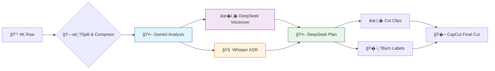

# � Clio �AI Preprocessing Pipeline

> 🧠 **Raw footage �Compress �AI understands �Voiceover scripts �Edit plan �CapCut final cut**
>
> A CLI + Web UI tool designed for solo travel vloggers. Feed your GoPro/phone 4K footage to AI, get summaries, timelines, voiceover scripts, and edit plans �then put the final touches (effects, lip-sync) in **CapCut (JianYing)**.

[](https://github.com/Leisurelybear/vlog-editing-helper/actions/workflows/test.yml)
[](https://codecov.io/gh/Leisurelybear/vlog-editing-helper)


[](LICENSE)

**English** · [简体中文](README.md)

---

## �Features

| | Feature | AI | Description |
|---|---------|----|-------------|
| 🗜�| **Smart Compression** | | 4K �640p · strip audio · analyze windows for long clips · ~5MB per clip |
| 🤖 | **AI Video Understanding** | �Gemini | Watches footage �title / location / mood / summary / timeline |
| �� | **AI Voiceover** | �DeepSeek | Writes narration from template + AI analysis |
| 📋 | **AI Edit Planning** | �DeepSeek | AI arranges segment order, target duration, theme |
| 🧠 | **AI ASR Transcription** | �Whisper | faster-whisper offline ASR with CUDA |
| 🔧 | **AI Refine** | �DeepSeek | Review + fix output with trip context, `--fix` support |
| ��| **Label Burn-in** | | Burn index watermark onto compressed video |
| ✂� | **Precision Cutting** | | Plan-based cutting, fast or re-encode |
| � | **Web UI Editor** | | Zero deps, browser-based editing & pipeline |
| 🚀 | **One-shot Pipeline** | �| `run --day day1` does it all, skips existing |

---

## 🖥�Web UI Editor

**Pure Python stdlib at runtime** (`http.server`). No frontend build is required; UI unit tests require Node.js 18+ (CI uses Node 22).

<div align="center">
  
  <br><sub>� Pipeline runner</sub>
  <br><br>
  
  <br><sub>🤖 AI analysis editor</sub>
  <br><br>
  
  <br><sub>�� Voiceover editor</sub>
  <br><br>
  
  <br><sub>📋 Edit plan</sub>
  <br><br>
  
  <br><sub>� Project management</sub>
</div>

- � **HTML5 Player** �seek / jump / speed (0.5x�x) / Range requests
- 📂 **Source Toggle** �switch between compressed / original view
- � **Three Editing Tabs** �Analysis / Voiceover / Plan, Ctrl+S to save
- �**Visual Config Editor** �Full YAML form, global & per-project modes
- �**Pipeline Runner** �Step-by-step or full run, live progress + ETA
- 🔄 **Whisper Model Download** �One-click in UI, auto-rerun transcription

Launch: `python main.py serve` �open `http://127.0.0.1:8765`

Security notes:

- By default the UI listens on `127.0.0.1`, so only the local machine can access it.
- `python main.py serve --host 0.0.0.0` exposes the UI to your LAN; other devices may access project directories, video previews, and config APIs. Use it only on trusted networks.
- When exposing the UI to a LAN, prefer `--token <random-long-string>`. If omitted, the server auto-generates an API token and prints a `Token URL` in the terminal.
- Do not expose the UI directly to the public internet. Use a VPN or SSH tunnel for remote access.

---

## 🧩 Pipeline Steps



| Step | AI Engine | Command | Input �Output |
|------|-----------|---------|---------------|
| 1�⃣ Compress | | `compress` | 4K raw �640p / ~5MB / no audio (1 original -> 1 compressed) |
| 2�⃣ 🤖 **AI Analysis** | **Gemini** 2.5 Flash | `analyze` | Video �AI summary + timeline JSON |
| 3�⃣ �� **AI Voiceover** | **DeepSeek** / OpenAI | `scripts` | Analysis �AI-generated narration |
| 4�⃣ 🧠 **AI Transcription** | **Whisper** ASR | `transcribe` | Video �Offline speech-to-text |
| 5�⃣ 🤖 **AI Planning** | **DeepSeek** / OpenAI | `plan --day day1` | Analysis + transcripts �AI edit plan |
| 6�⃣ 🔧 **AI Refine** | **DeepSeek** / Gemini | `refine` | Output + trip context �AI fix |
| 7�⃣ Cut | | `cut --day day1` | Plan �Timestamp clip extraction |
| 8�⃣ Label | | `label` | Video �Burn index watermark |
| 🚀 Full Pipeline | All AI | `run --day day1` | Executes all steps sequentially |

> 💡 Supports **single-file** processing: `python main.py analyze -i "output/compressed/001_GL010685.mp4"`
> 💡 Each step independently skips existing output; add `--force` to regenerate

---

## 🚀 Quick Start

### 📦 One-line Setup

```bash
# Windows 🪟
.\setup.ps1

# Linux / macOS �
./setup.sh
```

Auto-creates venv �installs deps �installs ffmpeg �creates `.env`.

### 🔑 Configure API Keys

```bash
# Edit .env with your keys
GEMINI_API_KEY=your_Gemini_API_Key
DEEPSEEK_API_KEY=your_DeepSeek_API_Key
```

### ⚙� Edit Config

```bash
cp config.example.yaml config.yaml
# Edit paths.input_dir, proxy.url, etc.
```

### ▶� Run It

```bash
# � Full pipeline
python main.py run -i "E:/Videos/🇫🇷ParisTrip" --day day1

# � Environment check
python main.py check

# 🩺 Full diagnostics (config / ffmpeg / API keys / Node, etc.)
python main.py doctor

# � Launch UI
python main.py serve
```

---

## 🧠 Multi-Provider AI

| Task | Recommended | Type | Description |
|------|-------------|------|-------------|
| � Video Analysis | **Gemini** 2.5 Flash | Multimodal | Watches video, outputs title/location/timeline |
| �� Voiceover | **DeepSeek** / OpenAI | Text | Generates narration from template |
| 📋 Edit Plan | **DeepSeek** / OpenAI | Text | Arranges segment sequence |
| 🔧 Refine | Same (configurable) | Text | Fixes output with trip context |

Each task can use a different provider/model via `config.yaml` �`ai.tasks`. Supports **OpenAI-compatible APIs** (Tongyi Qianwen, Kimi, etc.). OpenAI-compatible providers can set `timeout_sec` for slow gateways or local models.

📌 **Automatic trip context injection**: write your trip background and known pitfalls once in `templates/trip_context.md`, injected into every AI call.

---

## � Typical Workflow

```
📹 Home from a shoot, plug in GoPro SD card

> python main.py run -i "E:/2025-10 Paris" --day day1
>   ⚙� Split 3 clips (34min total)
>   ⚙� Compressed (avg 4.8MB each)
> ── 🤖 AI takes over ──────────────────
>   �Gemini analyzed all footage �titles / timelines
>   �DeepSeek wrote voiceover scripts �templated style
>   �Whisper ASR done �medium model, offline
>   �DeepSeek planned edit order �11 segs / ~3min
> ── 🔧 Non-AI steps ──────────────────
>   �Clips cut by plan
>   �Index labels burned

> python main.py serve
  �Browser: review AI output, tweak scripts, reorder, preview

📱 Open CapCut, import output/cuts/day1/, drag, add effects, done!
```

---

## � Project Structure

```
vlog-video-analysis/
├── main.py                    # � CLI entry
├── config.example.yaml        # 📋 Config template
├── setup.ps1 / setup.sh       # 🚀 One-click installer
├── serve.ps1 / serve.sh       # � One-click UI launcher
├── templates/
�  ├── trip_context.md        # 🗺�Trip background (auto-injected)
�  └── vlog_template.md       # � Voiceover template (customizable)
├── clio/
�  ├── compress.py            # 🗜�ffmpeg wrapper
�  ├── analyze.py             # 🤖 AI analysis logic
�  ├── transcribe.py          # ��Whisper ASR
�  ├── prompts.py             # 💬 All prompt templates
�  ├── pipeline.py            # 🔄 Pipeline orchestration
�  ├── config/                # ⚙� Config parsing / validation
�  ├── ai/                    # 🧠 AI adapters (Gemini / OpenAI compat)
�  ├── tasks/                 # 📂 Step implementations
�  ├── ui/                    # � Web UI (stdlib only, zero deps)
�  └── tests/                 # 🧪 1200+ unit tests
└── output/
    ├── compressed/            # 🗜�Compressed videos
    ├── texts/                 # � AI analysis JSON
    ├── transcripts/           # ��ASR transcripts JSON
    ├── scripts/               # �� Voiceover scripts
    ├── plans/                 # 📋 Edit plans
    ├── cuts/                  # ✂� Cut segments
    └── labeled/               # ��Label-burned videos
```

---

## 🧪 Testing & Quality

```bash
python -m pytest clio/tests/ -v

# 1200+ tests · GitHub Actions CI (Ubuntu + Windows · 3.11 / 3.12)
# Code style: ruff (format + lint)
```

| Module | Tests | Coverage |
|--------|-------|----------|
| 🧩 config | 46 | Loading / merging / validation / descriptions |
| 🛠�utils | 74 | extract_json / ffmpeg discovery / atomic IO / subprocess |
| � cut | 26 | Time parsing / filename gen / offset |
| 📊 progress | 15 | Progress / ETA |
| 🤖 ai series | 60 | Gemini / OpenAI / retry / cache |
| 🧠 analyze | 19 | File matching / context injection |
| � routes | 103 | Video / config / plan / transcript / env APIs |
| 🔄 tasks | 81 | Step orchestration / cancel / file filter |
| ��transcribe | 20 | Toggle / device / model / CUDA |
| 📦 file_service | 61 | Safe path / atomic save / segment match |
| � project | 22 | Output dir / registry / step detection |
| 📊 processing_state | 8 | Mark / reset / persistence |
| 🧪 vmeta | 13 | Sidecar meta / index / staleness |
| Others | ~96 | Pipeline / plan / log / ratelimit / main entry etc. |

---

## 📚 Documentation

| Doc | Description |
|-----|-------------|
| [AGENTS.md](AGENTS.md) | 🧑��AI maintenance manual (structure / conventions / gotchas) |
| [ROADMAP.md](ROADMAP.md) | 🗺�Feature tracking & roadmap |
| [docs/cli-reference.md](docs/cli-reference.md) | 📖 Full CLI reference |
| [clio/ui/README.md](clio/ui/README.md) | 🖥�Web UI detailed guide |

---

---

## �FAQ

### ffmpeg not found

Run `.\setup.ps1` (Windows) or `./setup.sh` (Linux/Mac) to auto-install, or set paths manually in `config.yaml`.

### socksio package not installed

```bash
python -m pip install -r requirements.txt
```

### File is not in an ACTIVE state

The tool polls automatically for Google's video processing; if it fails, retry later.

### ConnectTimeout / network errors

Check your proxy settings in `config.yaml`.

### pip install fails

Make sure you're using the project virtual environment (Windows: `.venv\Scripts\activate`, Linux/Mac: `source .venv/bin/activate`):

```bash
python -m pip install -r requirements.txt
```

### Re-analyze a single video

Delete the corresponding `.json`/`.txt` from `output/texts/`, or set `analyze.skip_existing: false`.

---

## � Contributing

Personal vlogger tool �[Issues](https://github.com/Leisurelybear/vlog-editing-helper/issues) and PRs welcome.

```bash
.venv\Scripts\activate         # Windows
source .venv/bin/activate      # Linux/Mac
ruff format clio main.py       # Format
ruff check clio main.py        # Lint
python -m pytest -v            # Test
```

---

## 🚀 Future Vision

> This is just the beginning. Here's what we're exploring:

| Vision | Description |
|--------|-------------|
| 🧠 **Local AI Inference** | Integrate llama.cpp / ollama for fully offline, zero-cost, privacy-first inference |
| 🖼�**AI Thumbnail Generation** | Auto-select frames + overlay titles for YouTube / Bilibili covers |
| � **Multi-language Voiceover** | AI translates Chinese voiceover to EN / JP / FR etc. |
| � **AI Music Recommendation** | Analyze video mood �suggest matching BGM with auto beat sync |
| � **Collaborative Editing** | Project sharing, cloud sync for team vlog production |
| 📊 **AI Edit Scoring** | Auto-evaluate pacing, shot diversity, give improvement suggestions |
| � **Plugin Marketplace** | Third-party plugin system: custom AI steps, export templates, effects |

**Got ideas? �[Open an Issue](https://github.com/Leisurelybear/vlog-editing-helper/issues) �*

---

<p align="center">
  <b>🗜��🤖 ��� �🧠 �📋 �🔧 �✂� ��</b>
  <br>
  <sub>AI-powered vlog creation · From raw footage to final cut, faster</sub>
</p>

## Prompt Overrides

Create Markdown files in `templates/prompts/` to override built-in AI prompts without editing Python code. Runtime prompts from the Run panel take priority over these files, and both still receive trip/context injection before the AI call.

Supported files: `video_analyze.md`, `voiceover.md`, `vlog_plan.md`, `refine_text.md`, `refine_text_fix.md`, `refine_script.md`, `refine_script_fix.md`, and `transcript_context.md`.

Prompt files are validated before AI requests. Missing or unknown `{placeholder}` values fail early; use `{{` and `}}` for literal JSON braces.
