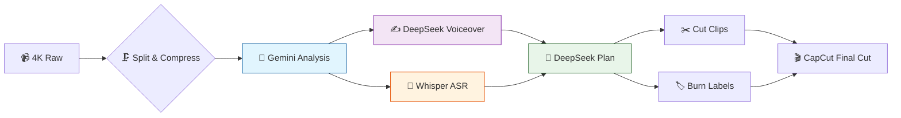

# 🎬 Vlog Editing Helper — AI Preprocessing Pipeline

> 🧠 **Raw footage → Compress → AI understands → Voiceover scripts → Edit plan → CapCut final cut**
>
> Feed your GoPro/phone 4K footage to AI, get summaries, timelines, voiceover scripts, and edit plans — then finish with effects and lip-sync in **CapCut (JianYing)**.

[](https://github.com/Leisurelybear/vlog-editing-helper/actions/workflows/test.yml)
[](https://codecov.io/gh/Leisurelybear/vlog-editing-helper)


[](LICENSE)

**English** · [简体中文](README.md)

---

## ✨ Features

| | Feature | AI | Description |
|---|---------|----|-------------|
| 🗜️ | **Smart Compression** | | 4K→640p·strip audio·auto-split·~5MB |
| 🤖 | **AI Video Understanding** | ✅ Gemini | Watches footage→title/location/timeline |
| ✍️ | **AI Voiceover** | ✅ DeepSeek | Writes narration from template |
| 📋 | **AI Edit Planning** | ✅ DeepSeek | Arranges segment order/duration |
| 🧠 | **AI ASR Transcription** | ✅ Whisper | faster-whisper offline + CUDA |
| 🔧 | **AI Refine** | ✅ DeepSeek | Trip context review·`--fix` targeted fix |
| 🏷️ | **Label Burn-in** | | Index watermark for CapCut reference |
| ✂️ | **Precision Cutting** | | Plan-based cutting·fast/re-encode |
| 🌐 | **Web UI Editor** | | Zero deps·browser editing+pipeline |
| 🚀 | **One-shot Pipeline** | ✅ | `run --day day1` skips existing |

---

## 🖥️ Screenshots

**Pure Python stdlib** (`http.server`). No Node.js / npm / build step.

<div align="center">
  
  <br><sub>🏃 Pipeline runner — step-by-step or full run·live progress·ETA</sub>
  <br><br>
  
  <br><sub>🤖 AI analysis editor — summary·timeline·manual tweaks</sub>
  <br><br>
  
  <br><sub>✍️ Voiceover script editor — AI-generated·edit·save</sub>
  <br><br>
  
  <br><sub>📋 Edit plan — theme·segment order·preview playback</sub>
  <br><br>
  
  <br><sub>📁 Project management — create/switch/delete·visual config</sub>
</div>

Launch: `python main.py serve` → open `http://127.0.0.1:8765`

---

## 🧩 Pipeline



> 💡 Each step runs independently (`analyze`/`scripts`/`plan`/`transcribe`/`refine`/`cut`/`label`),
> supports single-file processing, `--force` to regenerate, auto-skips existing.

---

## 🚀 Quick Start

```bash
# 1️⃣ One-click setup (venv + ffmpeg + deps)
.\setup.ps1                    # Windows
./setup.sh                     # Linux / macOS

# 2️⃣ Edit .env with your API keys
GEMINI_API_KEY=your_Gemini_API_Key
DEEPSEEK_API_KEY=your_DeepSeek_API_Key

# 3️⃣ Run it
python main.py run -i "E:/Videos/🇫🇷ParisTrip" --day day1   # Full pipeline
python main.py serve                                         # Web UI
python main.py check                                         # Environment check
```

Each AI task can use a different provider/model (`config.yaml` → `ai.tasks`): Gemini / DeepSeek / OpenAI / Tongyi Qianwen / Kimi. Trip context auto-injected from `templates/trip_context.md`.

---

## 📚 Docs

| Doc | Description |
|-----|-------------|
| [docs/cli-reference.md](docs/cli-reference.md) | 📖 Full CLI reference |
| [vlog_tool/ui/README.md](vlog_tool/ui/README.md) | 🖥️ Web UI guide |
| [AGENTS.md](AGENTS.md) | 🧑‍💻 Project structure / conventions / gotchas |
| [ROADMAP.md](ROADMAP.md) | 🗺️ Feature tracking & roadmap |
| [FAQ →](https://github.com/Leisurelybear/vlog-editing-helper/issues) | ❓ ffmpeg / network / re-analyze etc. |

---

## 🤝 Contributing

Personal vlogger tool — [Issues](https://github.com/Leisurelybear/vlog-editing-helper/issues) and PRs welcome.

```bash
.venv\Scripts\activate         # Windows
source .venv/bin/activate      # Linux/Mac
ruff format . && ruff check . && python -m pytest -v
```

---

## 🚀 Future Vision

🧠 Local AI inference · 🖼️ AI thumbnails · 🌍 Multi-language voiceover · 🎵 AI music · 🤝 Collaboration · 📊 Edit scoring · 🏪 Plugins

[→ Share your ideas](https://github.com/Leisurelybear/vlog-editing-helper/issues)

---

<p align="center">
  <b>🗜️ → 🤖 → ✍️ → 🧠 → 📋 → 🔧 → ✂️ → 🎬</b>
  <br>
  <sub>AI-powered vlog creation · From raw footage to final cut, faster</sub>
</p>
