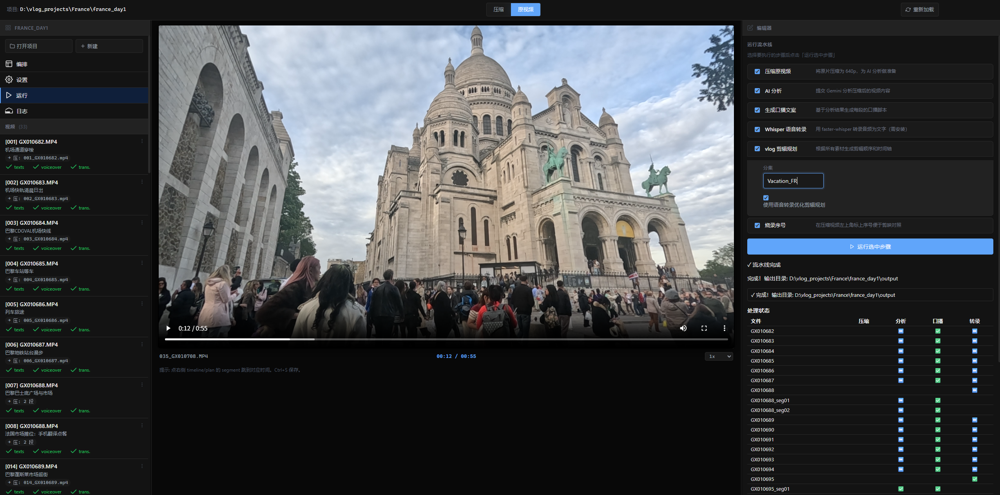
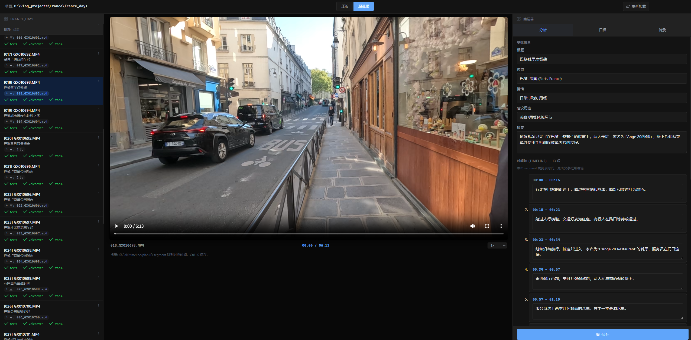
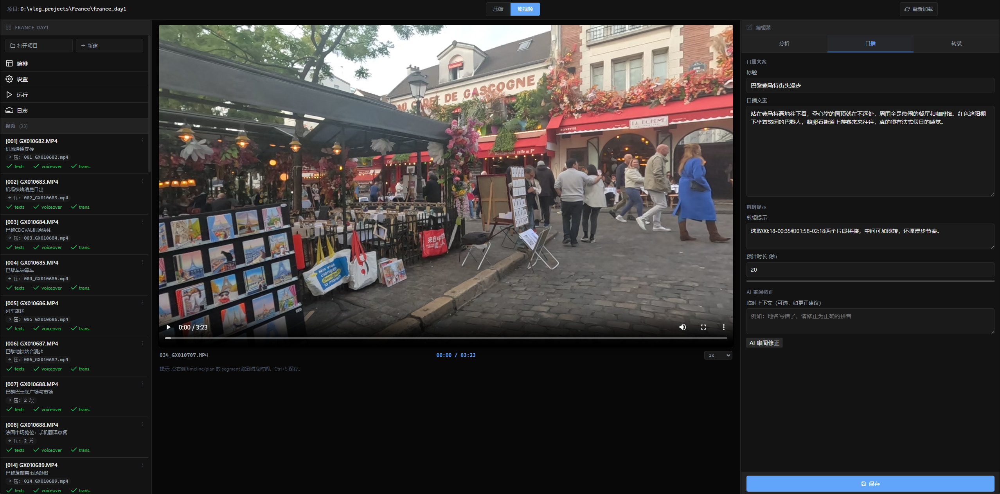
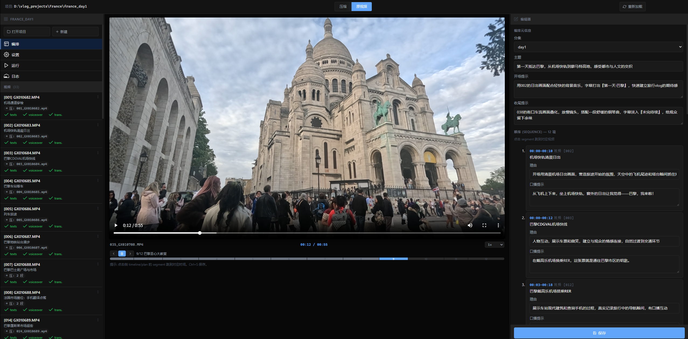
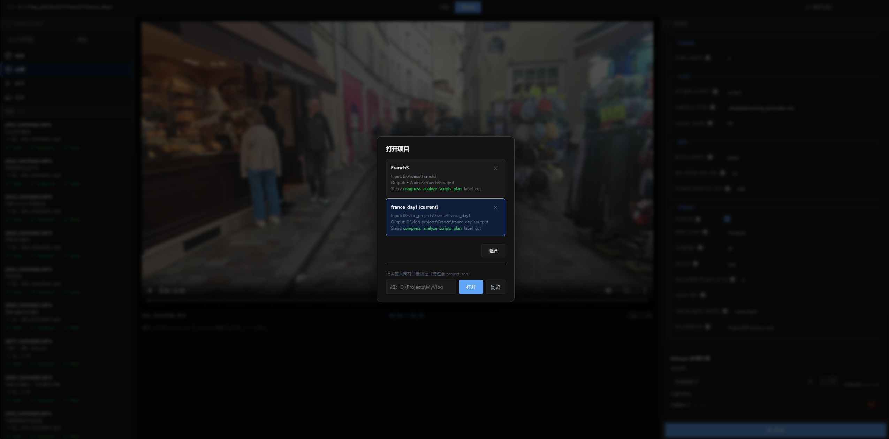
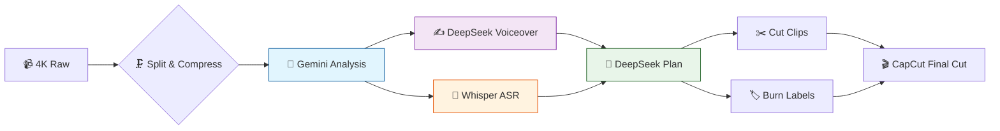

# 🎬 Clio — AI Preprocessing Pipeline

> 🧠 **Raw footage → Compress → AI understands → Voiceover scripts → Edit plan → CapCut final cut**
>
> A CLI + Web UI tool designed for solo travel vloggers. Feed your GoPro/phone 4K footage to AI, get summaries, timelines, voiceover scripts, and edit plans — then put the final touches (effects, lip-sync) in **CapCut (JianYing)**.

[](https://github.com/Leisurelybear/vlog-editing-helper/actions/workflows/test.yml)
[](https://codecov.io/gh/Leisurelybear/vlog-editing-helper)


[](LICENSE)

**English** · [简体中文](README.md)

---

## ✨ Features

| | Feature | AI | Description |
|---|---------|----|-------------|
| 🗜️ | **Smart Compression** | | 4K → 640p · strip audio · auto-split (15min) · ~5MB per clip |
| 🤖 | **AI Video Understanding** | ✅ Gemini | Watches footage → title / location / mood / summary / timeline |
| ✍️ | **AI Voiceover** | ✅ DeepSeek | Writes narration from template + AI analysis |
| 📋 | **AI Edit Planning** | ✅ DeepSeek | AI arranges segment order, target duration, theme |
| 🧠 | **AI ASR Transcription** | ✅ Whisper | faster-whisper offline ASR with CUDA |
| 🔧 | **AI Refine** | ✅ DeepSeek | Review + fix output with trip context, `--fix` support |
| 🏷️ | **Label Burn-in** | | Burn index watermark onto compressed video |
| ✂️ | **Precision Cutting** | | Plan-based cutting, fast or re-encode |
| 🌐 | **Web UI Editor** | | Zero deps, browser-based editing & pipeline |
| 🚀 | **One-shot Pipeline** | ✅ | `run --day day1` does it all, skips existing |

---

## 🖥️ Web UI Editor

**Pure Python stdlib** (`http.server`). No Node.js, no npm, no build step.

<div align="center">
  
  <br><sub>🏃 Pipeline runner</sub>
  <br><br>
  
  <br><sub>🤖 AI analysis editor</sub>
  <br><br>
  
  <br><sub>✍️ Voiceover editor</sub>
  <br><br>
  
  <br><sub>📋 Edit plan</sub>
  <br><br>
  
  <br><sub>📁 Project management</sub>
</div>

- 🎥 **HTML5 Player** — seek / jump / speed (0.5x–2x) / Range requests
- 📂 **Source Toggle** — switch between compressed / original view
- 📝 **Three Editing Tabs** — Analysis / Voiceover / Plan, Ctrl+S to save
- ⚙ **Visual Config Editor** — Full YAML form, global & per-project modes
- ▶ **Pipeline Runner** — Step-by-step or full run, live progress + ETA
- 🔄 **Whisper Model Download** — One-click in UI, auto-rerun transcription

Launch: `python main.py serve` → open `http://127.0.0.1:8765`

Security notes:

- By default the UI listens on `127.0.0.1`, so only the local machine can access it.
- `python main.py serve --host 0.0.0.0` exposes the UI to your LAN; other devices may access project directories, video previews, and config APIs. Use it only on trusted networks.
- When exposing the UI to a LAN, prefer `--token <random-long-string>`. If omitted, the server auto-generates an API token and prints a `Token URL` in the terminal.
- Do not expose the UI directly to the public internet. Use a VPN or SSH tunnel for remote access.

---

## 🧩 Pipeline Steps



| Step | AI Engine | Command | Input → Output |
|------|-----------|---------|---------------|
| 1️⃣ Compress | | `compress` | 4K raw → 640p / ~5MB / no audio / auto-split |
| 2️⃣ 🤖 **AI Analysis** | **Gemini** 2.5 Flash | `analyze` | Video → AI summary + timeline JSON |
| 3️⃣ ✍️ **AI Voiceover** | **DeepSeek** / OpenAI | `scripts` | Analysis → AI-generated narration |
| 4️⃣ 🧠 **AI Transcription** | **Whisper** ASR | `transcribe` | Video → Offline speech-to-text |
| 5️⃣ 🤖 **AI Planning** | **DeepSeek** / OpenAI | `plan --day day1` | Analysis + transcripts → AI edit plan |
| 6️⃣ 🔧 **AI Refine** | **DeepSeek** / Gemini | `refine` | Output + trip context → AI fix |
| 7️⃣ Cut | | `cut --day day1` | Plan → Timestamp clip extraction |
| 8️⃣ Label | | `label` | Video → Burn index watermark |
| 🚀 Full Pipeline | All AI | `run --day day1` | Executes all steps sequentially |

> 💡 Supports **single-file** processing: `python main.py analyze -i "output/compressed/001_GL010685.mp4"`
> 💡 Each step independently skips existing output; add `--force` to regenerate

---

## 🚀 Quick Start

### 📦 One-line Setup

```bash
# Windows 🪟
.\setup.ps1

# Linux / macOS 🐧
./setup.sh
```

Auto-creates venv → installs deps → installs ffmpeg → creates `.env`.

### 🔑 Configure API Keys

```bash
# Edit .env with your keys
GEMINI_API_KEY=your_Gemini_API_Key
DEEPSEEK_API_KEY=your_DeepSeek_API_Key
```

### ⚙️ Edit Config

```bash
cp config.example.yaml config.yaml
# Edit paths.input_dir, proxy.url, etc.
```

### ▶️ Run It

```bash
# 🏃 Full pipeline
python main.py run -i "E:/Videos/🇫🇷ParisTrip" --day day1

# 🔍 Environment check
python main.py check

# 🌐 Launch UI
python main.py serve
```

---

## 🧠 Multi-Provider AI

| Task | Recommended | Type | Description |
|------|-------------|------|-------------|
| 🎬 Video Analysis | **Gemini** 2.5 Flash | Multimodal | Watches video, outputs title/location/timeline |
| ✍️ Voiceover | **DeepSeek** / OpenAI | Text | Generates narration from template |
| 📋 Edit Plan | **DeepSeek** / OpenAI | Text | Arranges segment sequence |
| 🔧 Refine | Same (configurable) | Text | Fixes output with trip context |

Each task can use a different provider/model via `config.yaml` → `ai.tasks`. Supports **OpenAI-compatible APIs** (Tongyi Qianwen, Kimi, etc.).

📌 **Automatic trip context injection**: write your trip background and known pitfalls once in `templates/trip_context.md`, injected into every AI call.

---

## 🎯 Typical Workflow

```
📹 Home from a shoot, plug in GoPro SD card

> python main.py run -i "E:/2025-10 Paris" --day day1
>   ⚙️ Split 3 clips (34min total)
>   ⚙️ Compressed (avg 4.8MB each)
> ── 🤖 AI takes over ──────────────────
>   ✅ Gemini analyzed all footage → titles / timelines
>   ✅ DeepSeek wrote voiceover scripts → templated style
>   ✅ Whisper ASR done → medium model, offline
>   ✅ DeepSeek planned edit order → 11 segs / ~3min
> ── 🔧 Non-AI steps ──────────────────
>   ✅ Clips cut by plan
>   ✅ Index labels burned

> python main.py serve
  → Browser: review AI output, tweak scripts, reorder, preview

📱 Open CapCut, import output/cuts/day1/, drag, add effects, done!
```

---

## 📁 Project Structure

```
vlog-video-analysis/
├── main.py                    # 🎯 CLI entry
├── config.example.yaml        # 📋 Config template
├── setup.ps1 / setup.sh       # 🚀 One-click installer
├── serve.ps1 / serve.sh       # 🌐 One-click UI launcher
├── templates/
│   ├── trip_context.md        # 🗺️ Trip background (auto-injected)
│   └── vlog_template.md       # 📝 Voiceover template (customizable)
├── clio/
│   ├── compress.py            # 🗜️ ffmpeg wrapper
│   ├── analyze.py             # 🤖 AI analysis logic
│   ├── transcribe.py          # 🎙️ Whisper ASR
│   ├── prompts.py             # 💬 All prompt templates
│   ├── pipeline.py            # 🔄 Pipeline orchestration
│   ├── config/                # ⚙️ Config parsing / validation
│   ├── ai/                    # 🧠 AI adapters (Gemini / OpenAI compat)
│   ├── tasks/                 # 📂 Step implementations
│   ├── ui/                    # 🌐 Web UI (stdlib only, zero deps)
│   └── tests/                 # 🧪 860+ unit tests
└── output/
    ├── compressed/            # 🗜️ Compressed videos
    ├── texts/                 # 📝 AI analysis JSON
    ├── transcripts/           # 🎙️ ASR transcripts JSON
    ├── scripts/               # ✍️ Voiceover scripts
    ├── plans/                 # 📋 Edit plans
    ├── cuts/                  # ✂️ Cut segments
    └── labeled/               # 🏷️ Label-burned videos
```

---

## 🧪 Testing & Quality

```bash
python -m pytest clio/tests/ -v

# 860+ tests · GitHub Actions CI (Ubuntu + Windows · 3.11 / 3.12)
# Code style: ruff (format + lint)
```

| Module | Tests | Coverage |
|--------|-------|----------|
| 🧩 config | 46 | Loading / merging / validation / descriptions |
| 🛠️ utils | 74 | extract_json / ffmpeg discovery / atomic IO / subprocess |
| 🎬 cut | 26 | Time parsing / filename gen / offset |
| 📊 progress | 15 | Progress / ETA |
| 🤖 ai series | 60 | Gemini / OpenAI / retry / cache |
| 🧠 analyze | 19 | File matching / context injection |
| 🌐 routes | 103 | Video / config / plan / transcript / env APIs |
| 🔄 tasks | 81 | Step orchestration / cancel / file filter |
| 🎙️ transcribe | 20 | Toggle / device / model / CUDA |
| 📦 file_service | 61 | Safe path / atomic save / segment match |
| 📁 project | 22 | Output dir / registry / step detection |
| 📊 processing_state | 8 | Mark / reset / persistence |
| 🧪 vmeta | 13 | Sidecar meta / index / staleness |
| Others | ~96 | Pipeline / plan / log / ratelimit / main entry etc. |

---

## 📚 Documentation

| Doc | Description |
|-----|-------------|
| [AGENTS.md](AGENTS.md) | 🧑‍💻 AI maintenance manual (structure / conventions / gotchas) |
| [ROADMAP.md](ROADMAP.md) | 🗺️ Feature tracking & roadmap |
| [docs/cli-reference.md](docs/cli-reference.md) | 📖 Full CLI reference |
| [clio/ui/README.md](clio/ui/README.md) | 🖥️ Web UI detailed guide |

---

---

## ❓ FAQ

### ffmpeg not found

Run `.\setup.ps1` (Windows) or `./setup.sh` (Linux/Mac) to auto-install, or set paths manually in `config.yaml`.

### socksio package not installed

```bash
python -m pip install -r requirements.txt
```

### File is not in an ACTIVE state

The tool polls automatically for Google's video processing; if it fails, retry later.

### ConnectTimeout / network errors

Check your proxy settings in `config.yaml`.

### pip install fails

Make sure you're using the project virtual environment (Windows: `.venv\Scripts\activate`, Linux/Mac: `source .venv/bin/activate`):

```bash
python -m pip install -r requirements.txt
```

### Re-analyze a single video

Delete the corresponding `.json`/`.txt` from `output/texts/`, or set `analyze.skip_existing: false`.

---

## 🤝 Contributing

Personal vlogger tool — [Issues](https://github.com/Leisurelybear/vlog-editing-helper/issues) and PRs welcome.

```bash
.venv\Scripts\activate         # Windows
source .venv/bin/activate      # Linux/Mac
ruff format .                  # Format
ruff check .                   # Lint
python -m pytest -v            # Test
```

---

## 🚀 Future Vision

> This is just the beginning. Here's what we're exploring:

| Vision | Description |
|--------|-------------|
| 🧠 **Local AI Inference** | Integrate llama.cpp / ollama for fully offline, zero-cost, privacy-first inference |
| 🖼️ **AI Thumbnail Generation** | Auto-select frames + overlay titles for YouTube / Bilibili covers |
| 🌍 **Multi-language Voiceover** | AI translates Chinese voiceover to EN / JP / FR etc. |
| 🎵 **AI Music Recommendation** | Analyze video mood → suggest matching BGM with auto beat sync |
| 🤝 **Collaborative Editing** | Project sharing, cloud sync for team vlog production |
| 📊 **AI Edit Scoring** | Auto-evaluate pacing, shot diversity, give improvement suggestions |
| 🏪 **Plugin Marketplace** | Third-party plugin system: custom AI steps, export templates, effects |

**Got ideas? → [Open an Issue](https://github.com/Leisurelybear/vlog-editing-helper/issues) ✨**

---

<p align="center">
  <b>🗜️ → 🤖 → ✍️ → 🧠 → 📋 → 🔧 → ✂️ → 🎬</b>
  <br>
  <sub>AI-powered vlog creation · From raw footage to final cut, faster</sub>
</p>
