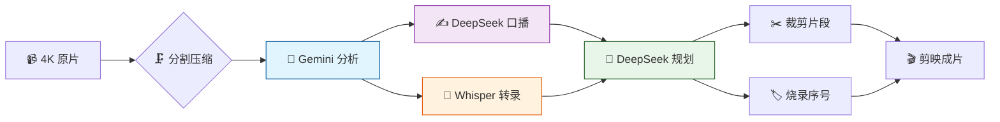

# 🎬 Clio — AI 预处理流水线

> 🧠 **原片 → 压缩 → AI 理解 → 口播文案 → 剪辑规划 → 剪映成片**
>
> 专为旅行 vlogger 打造的 CLI + Web UI 工具，把你的 GoPro / 手机 4K 素材喂给 AI，自动生成摘要、时间轴、口播稿和剪辑顺序，最后在 **剪映 (CapCut)** 里加特效、对口型收尾。

[](https://github.com/Leisurelybear/vlog-editing-helper/actions/workflows/test.yml)
[](https://codecov.io/gh/Leisurelybear/vlog-editing-helper)


[](LICENSE)

[English](README.en.md) · **简体中文**

---

## ✨ 特性一览

| | 特性 | AI 驱动 | 说明 |
|---|------|---------|------|
| 🗜️ | **智能压缩** | | 4K → 640p · 去音频 · 自动分段（15min）· 体积 ~5MB |
| 🤖 | **AI 视频理解** | ✅ Gemini | 看懂画面 → 标题 / 地点 / 心情 / 摘要 / 时间轴 |
| ✍️ | **AI 口播文案** | ✅ DeepSeek | 基于模板 + AI 分析，自动写 vlog 旁白稿 |
| 📋 | **AI 剪辑规划** | ✅ DeepSeek | AI 编排片段顺序、目标时长、主题 |
| 🧠 | **AI 语音转录** | ✅ Whisper | faster-whisper ASR，CUDA 加速，离线字幕稿 |
| 🔧 | **AI 审阅修正** | ✅ DeepSeek | trip 上下文审阅已有输出，支持定点修复 `--fix` |
| 🏷️ | **烧录序号** | | 把编号水印写到压缩视频上，剪映里对照不乱 |
| ✂️ | **精准裁剪** | | 按规划逐段裁剪，支持快剪 / 重编码 |
| 🌐 | **Web UI 编辑器** | | 零外部依赖，浏览器看视频 + 编辑 + 跑流水线 |
| 🚀 | **一键全流程** | ✅ | `run --day day1` 从头到尾，跳过已有产物 |

---

## 🖥️ Web UI 编辑器

**纯 Python 标准库**（`http.server`），无需 Node.js、无需 npm、无需构建。

<div align="center">
  
  <br><sub>🏃 流水线执行</sub>
  <br><br>
  
  <br><sub>🤖 AI 分析编辑</sub>
  <br><br>
  
  <br><sub>✍️ 口播文案编辑</sub>
  <br><br>
  
  <br><sub>📋 剪辑规划</sub>
  <br><br>
  
  <br><sub>📁 项目管理</sub>
</div>

- 🎥 **HTML5 播放器** — 拖动 / 跳转 / 倍速（0.5x~2x）/ Range 请求
- 📂 **源切换** — 一键切换「压缩版」/「原视频」视图
- 📝 **三 Tab 编辑** — 分析 / 口播 / 规划，改完 Ctrl+S 保存
- ⚙ **图形化配置** — 所有 YAML 字段渲染为表单，全局 / 项目双模式
- ▶ **流水线执行** — 分步跑 / 全跑，实时进度条 + ETA
- 🔄 **Whisper 模型下载** — UI 内一键下载，自动重跑转录

启动：`python main.py serve` → 浏览器打开 `http://127.0.0.1:8765`

---

## 🧩 流水线步骤



| 步骤 | AI 引擎 | 命令 | 输入 → 输出 |
|------|---------|------|------------|
| 1️⃣ 压缩 | | `compress` | 4K 原片 → 640p / ~5MB / 去音频 / 自动分段 |
| 2️⃣ 🤖 **AI 分析** | **Gemini** 2.5 Flash | `analyze` | 压缩视频 → AI 摘要 + 时间轴 JSON |
| 3️⃣ ✍️ **AI 口播** | **DeepSeek** / OpenAI | `scripts` | 分析 JSON → AI 生成旁白文案 |
| 4️⃣ 🧠 **AI 转录** | **Whisper** ASR | `transcribe` | 压缩视频 → 离线语音字幕 |
| 5️⃣ 🤖 **AI 规划** | **DeepSeek** / OpenAI | `plan --day day1` | 分析 + 转录 → AI 编排剪辑顺序 |
| 6️⃣ 🔧 **AI 审阅** | **DeepSeek** / Gemini | `refine` | 已有输出 + trip 上下文 → AI 修正 |
| 7️⃣ 裁剪 | | `cut --day day1` | 规划 → 按时间轴截取片段 |
| 8️⃣ 标号 | | `label` | 压缩视频 → 烧录序号水印 |
| 🚀 全流程 | 全部 AI | `run --day day1` | 依次执行所有步骤 |

> 💡 支持**单个文件**处理：`python main.py analyze -i "output/compressed/001_GL010685.mp4"`
> 💡 每步独立运行、自动跳过已有输出，加 `--force` 强制重跑

---

## 🚀 快速开始

### 📦 一行安装

```bash
# Windows 🪟
.\setup.ps1

# Linux / macOS 🐧
./setup.sh
```

脚本自动：创建虚拟环境 → 安装依赖 → 安装 ffmpeg → 创建 `.env`。

### 🔑 配置 API Key

```bash
# 编辑 .env 填入你的 Key
GEMINI_API_KEY=你的_Gemini_API_Key
DEEPSEEK_API_KEY=你的_DeepSeek_API_Key
```

### ⚙️ 修改配置

配置已拆分为两层：

- **`config.yaml`**（全局）：AI 厂商、API 密钥、代理、编解码参数等跨项目通用设置
- **`project.yaml`**（项目）：任务定义、AI 上下文、压缩尺寸、whisper 语言等项目级个性化

```bash
cp config.example.yaml config.yaml
# 全局配置：编辑 proxy、ai.providers 等
# 项目配置：在项目目录放置 project.yaml（参考 docs/project.example.yaml）
```

### ▶️ 跑起来

```bash
# 🏃 全流程
python main.py run -i "E:/Videos/🇫🇷巴黎之旅" --day day1

# 🔍 只看环境
python main.py check

# 🌐 启动 UI
python main.py serve
```

---

## 🧠 AI 多厂家支持

| 任务 | 推荐厂家 | 类型 | 说明 |
|------|---------|------|------|
| 🎬 视频分析 | **Gemini** 2.5 Flash | 多模态 | 看视频画面，输出标题/地点/时间轴 |
| ✍️ 口播文案 | **DeepSeek** / OpenAI | 纯文本 | 基于模板生成旁白 |
| 📋 剪辑规划 | **DeepSeek** / OpenAI | 纯文本 | 编排片段顺序 |
| 🔧 AI 审阅 | 同上（可独立配置） | 纯文本 | 用 trip 上下文修正输出 |

每个任务可独立指定厂家和模型（`project.yaml` 的 `ai.tasks`），支持 **OpenAI 兼容接口**（通义千问 / Kimi 等）。

📌 **trip 上下文自动注入**：行程背景、避免误判提示（如 "不要把戴高乐机场 RER 误认为曼谷"）统一写在 `templates/trip_context.md`，每次 AI 调用前自动插入。—

## 🎯 典型工作流

```
📹 下班到家，把 GoPro SD 卡插上电脑

> python main.py run -i "E:/2025-10 巴黎" --day day1
>   ⚙️ 分割 3 段（共 34min 素材）
>   ⚙️ 压缩 3 段（平均每段 4.8MB）
> ── 🤖 AI 介入 ──────────────────────
>   ✅ Gemini 看完所有视频 → 输出标题 / 时间轴 / 摘要
>   ✅ DeepSeek 写完口播稿 → 符合模板风格
>   ✅ Whisper 语音转录 → medium 模型离线完成
>   ✅ DeepSeek 编排规划 → day1 共 11 片段 / ~3min
> ── 🔧 非 AI 步骤 ──────────────────
>   ✅ 按规划裁剪完成
>   ✅ 序号水印烧录完成

> python main.py serve
  → 浏览器打开，看 AI 产出、调文案、改顺序、预览

📱 打开剪映，导入 output/cuts/day1/，拖拽、加特效、收工！
```

---

## 📁 项目结构

```
vlog-video-analysis/
├── main.py                    # 🎯 CLI 入口
├── config.example.yaml        # 📋 配置模板
├── setup.ps1 / setup.sh       # 🚀 一键安装
├── serve.ps1 / serve.sh       # 🌐 一键启动 UI
├── templates/
│   ├── trip_context.md        # 🗺️ 行程背景（自动注入 AI）
│   └── vlog_template.md       # 📝 口播模板（可自定义）
├── clio/
│   ├── compress.py            # 🗜️ ffmpeg 压缩
│   ├── analyze.py             # 🤖 AI 分析逻辑
│   ├── transcribe.py          # 🎙️ Whisper 转录
│   ├── prompts.py             # 💬 所有提示词模板
│   ├── pipeline.py            # 🔄 流水线编排
│   ├── config/                # ⚙️ 配置解析 / 校验
│   ├── ai/                    # 🧠 AI 适配层（Gemini / OpenAI 兼容）
│   ├── tasks/                 # 📂 各步骤具体实现
│   ├── ui/                    # 🌐 Web UI（零依赖纯 stdlib）
│   └── tests/                 # 🧪 970+ 单元测试
└── output/
    ├── compressed/            # 🗜️ 压缩后的视频
    ├── texts/                 # 📝 AI 分析结果 JSON
    ├── transcripts/           # 🎙️ 语音转录 JSON
    ├── scripts/               # ✍️ 口播文案
    ├── plans/                 # 📋 剪辑规划
    ├── cuts/                  # ✂️ 裁剪片段
    └── labeled/               # 🏷️ 带有编号水印的视频
```

---

## 🧪 测试 & 质量

```bash
# 跑全部测试
python -m pytest clio/tests/ -v

# 970+ 用例 · GitHub Actions CI（Ubuntu + Windows · 3.11 / 3.12）
# 代码风格: ruff (format + lint)
```

| 模块 | 用例数 | 覆盖内容 |
|------|-------|---------|
| 🧩 config | 46 | 加载 / 合并 / 校验 / 描述 |
| 🛠️ utils | 74 | extract_json / ffmpeg 发现 / 原子 IO / 子进程 |
| 🎬 cut | 26 | 时间解析 / 文件名生成 / 偏移 |
| 📊 progress | 15 | 进度追踪 / ETA |
| 🤖 ai 系列 | 60 | Gemini / OpenAI 兼容 / 重试 / 缓存 |
| 🧠 analyze | 19 | 文件匹配 / 上下文注入 / 验证 |
| 🌐 routes | 103 | 视频 / 配置 / 规划 / 转录 / 环境 API |
| 🔄 tasks 系列 | 81 | 各步骤编排 / 取消传播 / 文件过滤 |
| 🎙️ transcribe | 20 | 转录开关 / 设备 / 模型 / CUDA |
| 📦 file_service | 61 | 安全路径 / 原子保存 / 段匹配 |
| 📁 project | 22 | 目录 / 注册表 / 步骤检测 |
| 📊 processing_state | 8 | 标记 / 重置 / 持久化 |
| 🧪 vmeta | 13 | 侧边栏元数据 / 索引 / 过期检测 |
| 其他 | ~96 | pipeline / plan / log / ratelimit / 主入口等 |

---

## 📚 文档

| 文档 | 说明 |
|------|------|
| [AGENTS.md](AGENTS.md) | 🧑‍💻 AI 接手维护手册（项目结构 / 约定 / 踩坑记录） |
| [ROADMAP.md](ROADMAP.md) | 🗺️ 需求追踪 & 路线图 |
| [docs/cli-reference.md](docs/cli-reference.md) | 📖 完整 CLI 命令参考 |
| [clio/ui/README.md](clio/ui/README.md) | 🖥️ Web UI 详细说明 |

---

---

## ❓ 常见问题

### 找不到 ffmpeg

1. 运行 `setup.ps1`（Windows）或 `setup.sh`（Linux/Mac）自动安装
2. 或手动安装后在 `config.yaml` 填写路径

### socksio package is not installed

```bash
python -m pip install -r requirements.txt
```

### File is not in an ACTIVE state

视频上传后需等待 Google 处理。工具已内置轮询；若仍失败，稍后重试。

### ConnectTimeout / 网络错误

确认代理可用，检查 `config.yaml` 中 `proxy.url`。

### pip 安装失败

务必使用项目虚拟环境（Windows: `.venv\Scripts\activate`，Linux/Mac: `source .venv/bin/activate`）：

```bash
python -m pip install -r requirements.txt
```

### 重新分析某个视频

删除 `output/texts/` 中对应的 `.txt` 和 `.json`，或设置 `analyze.skip_existing: false`。

---

## 🤝 贡献

个人 vlogger 效率工具，欢迎 [Issue](https://github.com/Leisurelybear/vlog-editing-helper/issues) 反馈和 PR。

```bash
# 本地开发
.\.venv\Scripts\activate   # Windows
source .venv/bin/activate   # Linux/Mac
ruff format .               # 格式化
ruff check .                # 检查
python -m pytest -v         # 测试
```

---

## 🚀 未来愿景

> 这只是开始。以下是我们正在探索的方向：

| 愿景 | 描述 |
|------|------|
| 🧠 **本地 AI 推理** | 接入 llama.cpp / ollama，纯本地运行，隐私无忧、零 API 费用 |
| 🖼️ **AI 封面生成** | 从视频中自动选帧 + 叠加标题，生成 YouTube / Bilibili 封面 |
| 🌍 **多语言口播** | AI 自动将中文口播翻译为英 / 日 / 法等多语言版本 |
| 🎵 **AI 配乐推荐** | 分析视频情绪 → 推荐匹配的背景音乐 + 自动卡点 |
| 🤝 **多人协作** | 项目共享、云端同步，团队 vlog 协作编辑 |
| 📊 **AI 剪辑评分** | 自动评估剪辑节奏、镜头多样性，给出改进建议 |
| 🏪 **插件市场** | 第三方插件系统：自定义 AI 步骤、导出模板、特效预设 |

**你的想法也欢迎 → [提 Issue](https://github.com/Leisurelybear/vlog-editing-helper/issues) ✨**

---

<p align="center">
  <b>🗜️ → 🤖 → ✍️ → 🧠 → 📋 → 🔧 → ✂️ → 🎬</b>
  <br>
  <sub>用 AI 加速你的 vlog 创作 · 从素材到成片，快人一步</sub>
</p>
