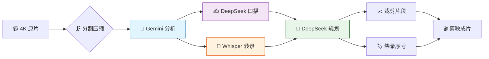

# 🎬 Vlog 剪辑辅助工具 — AI 预处理流水线

> 🧠 **原片 → 压缩 → AI 理解 → 口播文案 → 剪辑规划 → 剪映成片**
>
> 把你的 GoPro / 手机 4K 素材喂给 AI，自动生成摘要、时间轴、口播稿和剪辑顺序，最后在 **剪映 (CapCut)** 里加特效收尾。

[](https://github.com/Leisurelybear/vlog-editing-helper/actions/workflows/test.yml)
[](https://codecov.io/gh/Leisurelybear/vlog-editing-helper)


[](LICENSE)

[English](README.en.md) · **简体中文**

---

## ✨ 特性一览

| | 特性 | AI | 说明 |
|---|------|----|------|
| 🗜️ | **智能压缩** | | 4K→640p·去音频·自动分段·~5MB |
| 🤖 | **AI 视频理解** | ✅ Gemini | 看懂画面→标题/地点/时间轴 |
| ✍️ | **AI 口播文案** | ✅ DeepSeek | 基于模板自动写旁白稿 |
| 📋 | **AI 剪辑规划** | ✅ DeepSeek | 编排片段顺序/目标时长 |
| 🧠 | **AI 语音转录** | ✅ Whisper | faster-whisper 离线 ASR + CUDA |
| 🔧 | **AI 审阅修正** | ✅ DeepSeek | trip 上下文审阅·`--fix` 定点修复 |
| 🏷️ | **烧录序号** | | 编号水印·剪映里对照不乱 |
| ✂️ | **精准裁剪** | | 按规划逐段裁剪·快剪/重编码 |
| 🌐 | **Web UI 编辑器** | | 零外部依赖·浏览器编辑+跑流水线 |
| 🚀 | **一键全流程** | ✅ | `run --day day1` 跳过已有产物 |

---

## 🖥️ 界面预览

**纯 Python 标准库**（`http.server`），无需 Node.js / npm / 构建。

<div align="center">
  
  <br><sub>🏃 流水线执行 — 分步/全跑·实时进度·ETA</sub>
  <br><br>
  
  <br><sub>🤖 AI 分析编辑 — 摘要·时间轴·手动调整</sub>
  <br><br>
  
  <br><sub>✍️ 口播文案编辑 — AI 生成·就地修改·保存</sub>
  <br><br>
  
  <br><sub>📋 剪辑规划 — 主题·片段顺序·预览播放</sub>
  <br><br>
  
  <br><sub>📁 项目管理 — 新建/切换/删除项目·图形化配置</sub>
</div>

启动：`python main.py serve` → 浏览器打开 `http://127.0.0.1:8765`

---

## 🧩 流水线



> 💡 每步可独立运行（`analyze`/`scripts`/`plan`/`transcribe`/`refine`/`cut`/`label`），
> 支持单个文件处理，`--force` 强制重跑，自动跳过已有输出。

---

## 🚀 快速开始

```bash
# 1️⃣ 一键安装（venv + ffmpeg + 依赖）
.\setup.ps1                    # Windows
./setup.sh                     # Linux / macOS

# 2️⃣ 编辑 .env 填入 API Key
GEMINI_API_KEY=你的_Gemini_API_Key
DEEPSEEK_API_KEY=你的_DeepSeek_API_Key

# 3️⃣ 跑起来
python main.py run -i "E:/Videos/🇫🇷巴黎之旅" --day day1   # 全流程
python main.py serve                                        # Web UI
python main.py check                                        # 环境检查
```

每个 AI 任务可独立指定厂家和模型（`config.yaml` → `ai.tasks`），支持 Gemini / DeepSeek / OpenAI / 通义千问 / Kimi 等。trip 上下文自动注入 `templates/trip_context.md`。

---

## 📚 了解更多

| 文档 | 说明 |
|------|------|
| [docs/cli-reference.md](docs/cli-reference.md) | 📖 完整 CLI 命令参考 |
| [vlog_tool/ui/README.md](vlog_tool/ui/README.md) | 🖥️ Web UI 详细说明 |
| [AGENTS.md](AGENTS.md) | 🧑‍💻 项目结构 / 约定 / 踩坑记录 |
| [ROADMAP.md](ROADMAP.md) | 🗺️ 需求追踪 & 路线图 |
| [常见问题 →](https://github.com/Leisurelybear/vlog-editing-helper/issues) | ❓ ffmpeg / 网络 / 重分析等 |

---

## 🤝 贡献

个人 vlogger 工具，欢迎 [提 Issue](https://github.com/Leisurelybear/vlog-editing-helper/issues) 和 PR。

```bash
.\.venv\Scripts\activate   # Windows
source .venv/bin/activate   # Linux/Mac
ruff format . && ruff check . && python -m pytest -v
```

---

## 🚀 未来愿景

🧠 本地 AI 推理 · 🖼️ AI 封面生成 · 🌍 多语言口播 · 🎵 AI 配乐推荐 · 🤝 多人协作 · 📊 AI 剪辑评分 · 🏪 插件市场

[→ 提 Issue 告诉我们你的想法](https://github.com/Leisurelybear/vlog-editing-helper/issues)

---

<p align="center">
  <b>🗜️ → 🤖 → ✍️ → 🧠 → 📋 → 🔧 → ✂️ → 🎬</b>
  <br>
  <sub>用 AI 加速 vlog 创作 · 从素材到成片，快人一步</sub>
</p>
